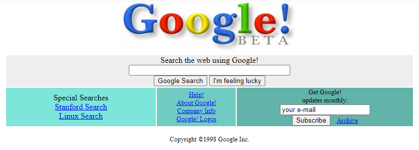
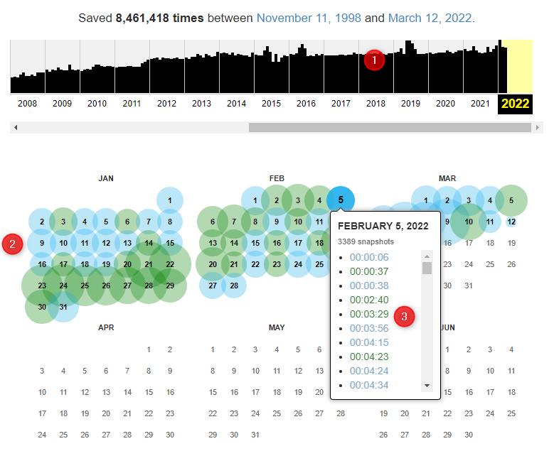

---
hide:
#  - navigation
  - toc
title: Visualizzare l'archivio delle versioni di una pagina web salvate su Internet Archive
---

Internet Archive può conservare **più versioni** della stessa **pagina web**, e mostrarne le **variazioni** nel **tempo**. Questo è una delle caratteristiche di più grande interesse, perché consente di guardare alla storia di un sito, di un progetto, di un'azienda, di qualsiasi cosa abbia lasciato una traccia nel web (e che sia stata archiviata su Internet Archive).

La prima pagina web è stata visitata nel 1991: tanto, tanto tempo fa, non c'era nemmeno Google (il motore di ricerca), e sembra impossibile. 
Il pervasivo motore di ricerca fa infatti il suo debutto in società nel 1998 e grazie a Internet Archive è possibile scoprire che [aveva questo aspetto](https://web.archive.org/web/19981202230410/http://www.google.com:80/).

<figure markdown>
  
</figure>

Da allora, questa pagina è stata archiviata quasi [**8,5 milioni di volte**](https://web.archive.org/web/*/http://www.google.com/), ed possibile seguirne l'evoluzione nel tempo, con il calendario delle versioni.

In questa pagina, ci sono 3 blocchi principali (vedi immagine di sotto):

1. il grafico a barre, che mostra il numero di versioni archiviate per una pagina negli anni. Al click ci si sposta nell'anno visualizzato nella parte bassa;
2. il calendario giornaliero delle versioni archiviate durante l'anno (la pagina di *default* si apre nell'anno corrente). Per ogni giorno un cerchietto colorato: più è grande, più versioni sono presenti. Al click sul pallino si visualizza l'elenco delle versioni salvate quel giorno;
3. e infine - vedi punto precedente - le versioni archiviate per singolo giorno. Al click sulla versione, rappresentata dall'orario di archiviazione, si aprirà la pagina come era quell'anno, quel giorno a quella ora.

<figure markdown>
  
</figure>
