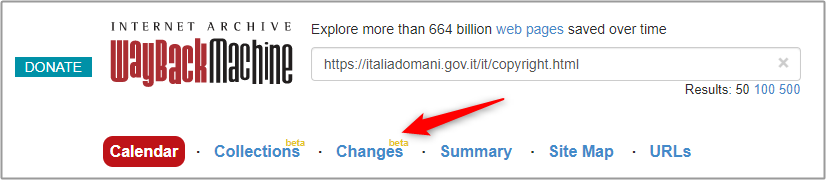
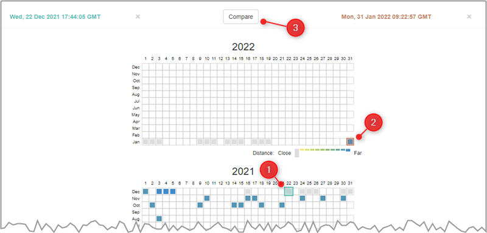
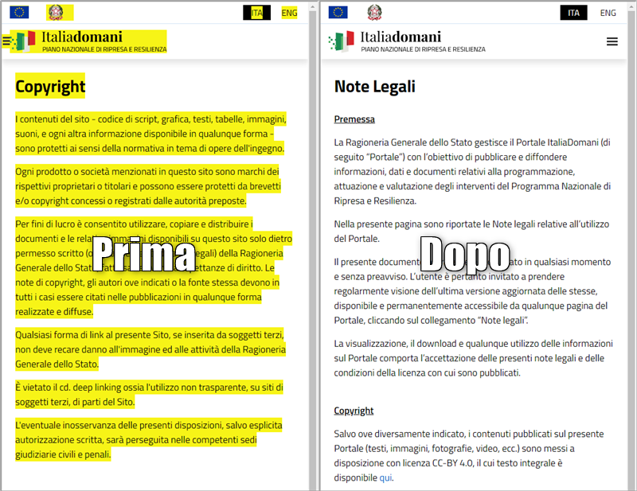

---
hide:
#  - navigation
  - toc
title: Visualizzare su Internet Archive le differenze di due versioni della stessa pagina
---

# Visualizzare le differenze tra due versioni della stessa pagina

In Internet Archive (di solito) sono [archiviate più versioni](archivio.md) di una stessa pagina web, che è possibile confrontare tra loro. 
Nel numero [📰 9 della newsletter di onData](https://ondata.substack.com/p/il-numero-9-della-nostra-newsletter-ci-siamo-messi-un-paio-di-medaglie-988291), ad esempio si raccontava del cambio delle note di *copyright* del sito Italiadomani (il sito del PNRR), di come finalmente i suoi contenuti siano diventati utilizzabili. 
A partire dal 3 agosto del 2021, [questa pagina è stata archiviata 39 volte](https://web.archive.org/web/*/https://italiadomani.gov.it/it/copyright.html) (al 12 marzo 2022): come confrontare come prima e dopo e il cambio di licenza?

Per osservare le variazioni tra due date, si può partire dalla [pagina](https://web.archive.org/web/*/https://italiadomani.gov.it/it/copyright.html) delle archiviazioni fatte e poi fare click su [`Changes`](https://web.archive.org/web/changes/https://italiadomani.gov.it/it/copyright.html) (vedi immagine di sotto).

<figure markdown>
  
</figure>

??? info "URL per visualizzare variazioni di una pagina"

    L'URL per visualizzare le variazioni di una pagina web su Internet Archive ha questa struttura: 
    `https://web.archive.org/web/changes/https://sitoesempio.it/pagina.html`

Poi si dovranno fare questi 3 passi:

1. selezionare la prima data (qui ad esempio è il 22 dicembre 2021);
2. selezionare la seconda (31 gennaio 2022);
3. fare click sul pulsante `Compare`.

<figure markdown>
  
</figure>

Dopo qualche secondo si aprirà la pagina che mostra le variazioni tra le due versioni della pagina. 
Questo esempio è interessante, perché il cambio è stato radicale.

<figure markdown>
  
  <figcaption>Il cambiamento delle note di copyright di <a href="https://web.archive.org/web/diff/20211222174405/20220131092257/https://italiadomani.gov.it/it/copyright.html">Italiadomani</a></figcaption>
</figure>

