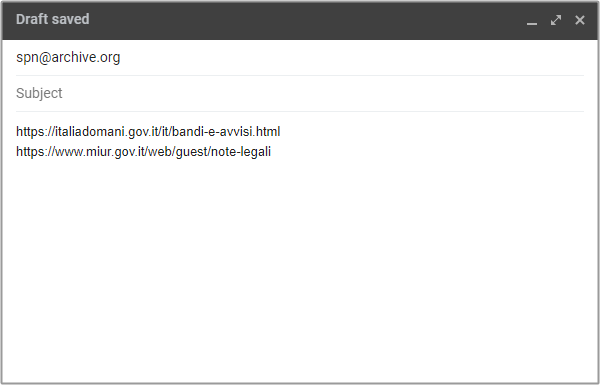
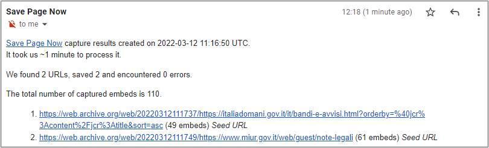
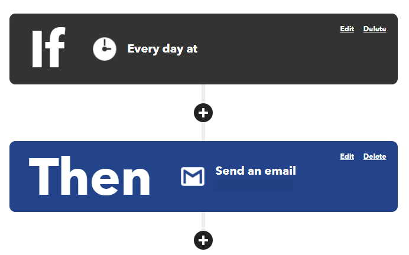

---
hide:
#  - navigation
  - toc
---

# Archiviare pagine su web archive tramite email

È una modalità semplicissima, di cui purtroppo non c'è una pagina di documentazione ufficiale:

- creare un nuovo messaggio di posta elettronica;
- inserire come **destinatario** `spn@archive.org`;
- inserire nel **corpo** del **messaggio** l'**elenco** degli **URL** che si vogliono archiviare, **uno per riga**;
- inviare il messaggio.

!!! warning "Attenzione"

    Il **numero massimo** di **URL** che si possono inserire è pari a **300**.

Ad esempio un'email come quella sottostante:

<figure markdown>
  
</figure>

Il messaggio verrà inserito nella coda di elaborazioni di Internet Archive e non appena possibile verrà elaborato. 
**Non appena** sarà **fatto**, il mittente **riceverà** un'**email** con il **riscontro dettagliato**. Se ci sono stati errori, verranno indicati nel messaggio. 
Qui sotto un esempio di risposta:

<figure markdown>
  
</figure>

## Eseguire la richiesta in modo periodico

Per certe pagine web può essere utile attivare l'**archiviazione** **periodica**, ad esempio una volta alla settimana: **basterà inviare l'email una volta alla settimana**.

Per farlo in modo automatico si possono attivare ad esempio queste modalità:

- sfruttando applicazioni come [IFTTT](https://ifttt.com/), [make](https://www.make.com/), [Zapier](https://zapier.com/), ecc.;
- attivando un'operazione pianificata su un *personal computer*, su un server;
- creando una [*github action*](https://github.com/features/actions) che se ne occupi o usandone [una già pronta](https://github.com/marketplace/actions/send-email).

<figure markdown>
  
  <figcaption>Esempio di invio automatico tramite IFTTT</figcaption>
</figure>
