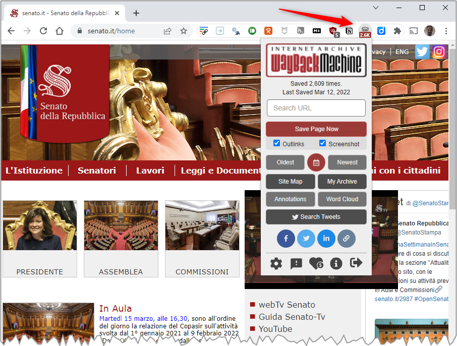
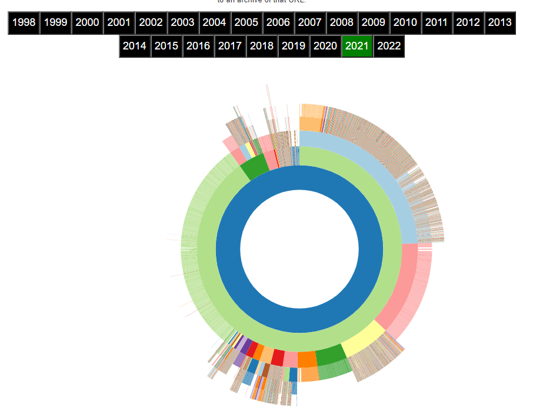

---
hide:
#  - navigation
#  - toc
title: Archiviare pagine su Internet Archive tramite una comoda estensione del browser
---

# Archiviare pagine su Internet Archive tramite un'estensione del browser

Questa - insieme a [quella per email](email.md) - è la modalità più diretta e semplice.

L'estensione è disponibile per:

- [Chrome](https://chrome.google.com/webstore/detail/wayback-machine/fpnmgdkabkmnadcjpehmlllkndpkmiak);
- [Safari](https://apps.apple.com/us/app/wayback-machine/id1472432422);
- [Firefox](https://addons.mozilla.org/en-US/firefox/addon/wayback-machine_new/).

Una volta installata, nella barra degli strumenti sarà presente un pulsante con il simbolo di Interent Archive: al click su questo, tutte le operazioni che rende disponibili. 
Sopra questo pulsante, una prima informazione utile: il numero di versioni salvate della pagina corrente.

<figure markdown>
  
</figure>

A seguire le funzioni principali.

## Save Page Now

È il tasto principale, che salva la pagina corrente su Internet Archive. Due preziose opzioni disponibili:

- `Outlinks`, per salvare una copia anche delle pagine web "*linkate*" nella pagina corrente;
- `Screenshot`, per salvare anche un'immagine della pagina corrente.

L'opzione `Outlinks` è preziosa ad esempio in presenza di una singola pagina, che contiene i *link* a decine di file, che verrebbero tutti archiviati con uno sforzo piccolissimo.

## Oldest, 📅 Calendario e Newest

Con questi tre tasti, al click, per la pagina corrente:

- `Oldest`, la prima versione archiviata;
- 📅, per avere la vista di insieme di tutte le versioni archiviate;
- `Newest`, l'ultima versione archiviata.

## Site Map

Questa funzione raggruppa crea una mappa del sito corrente, sotto forma di un grafico ad albero radiale, per ogni anno. Il cerchio centrale è la "radice" del sito Web e gli anelli successivi le pagine che da questa si sviluppano. 
Passando con il mouse sugli anelli e le celle, viene visualizzato l'URL corrispondente e al click si va direttamente a un archivio di quell'URL.

<figure markdown>
  
</figure>

## Replace 404s, etc...
When an error occurs, automatically check if an archived copy is available. Checks against 4xx & 5xx HTTP error codes.

## Wayback Machine Count
Display count of snapshots of the current page stored in the Wayback Machine.

## My Web Archive
Save URLs to your public archive page on the Internet Archive.

## Annotations
Provides a list of annotations for the current web page and domain, provided by Hypothes.is.

## Relevant Resources
View archived digitized books while visiting Amazon Books, research papers and books while visiting Wikipedia, and recommended TV News Clips while visiting news websites.

## Site Map & Word Cloud
Present a sunburst diagram for the domain you are currently viewing, or create a Word Cloud from the link's anchor text of the page you are on.

## Tweets & Share Links
Search Twitter for information regarding your current page, or share archived links on social media.
