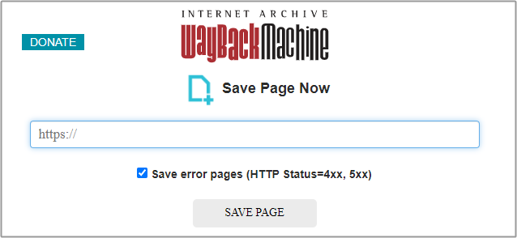
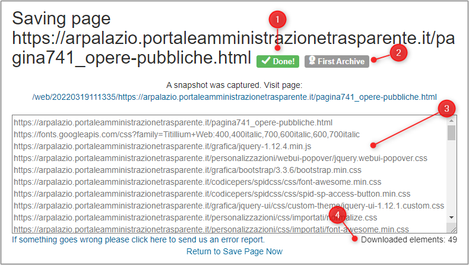
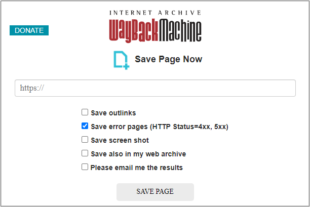
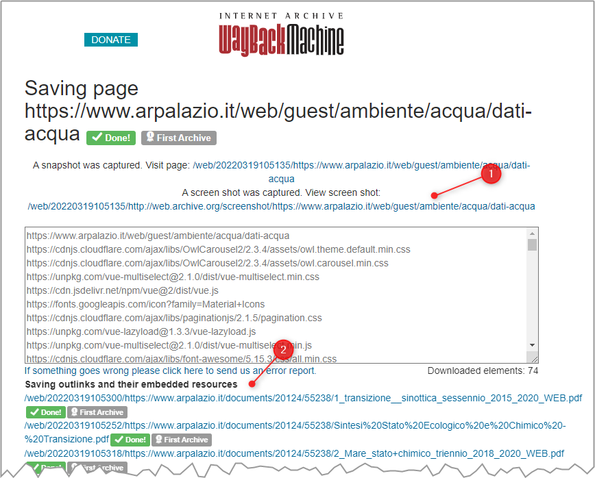

---
hide:
#  - navigation
#  - toc
title: Archiviare una pagina su Internet Archive tramite la pagina web dedicata
---

# Archiviare una pagina su Internet Archive tramite la pagina web dedicata

Questa - insieme a [quella per email](email.md) e quella tramite [estensione](estensione-browser.md) - è la modalità più diretta e semplice.

## Da utente anonimo

Basta aprire questa pagina - <https://web.archive.org/save/> - e fare *click* su <kbd>SAVE PAGE</kbd>.

<figure markdown>
  
</figure>

Al click si aprirà una pagina che, a processo terminato, restituisce:

1. se il processo è andato a buon fine;
2. se è la prima volta che la pagina scelta viene archiviata;
3. l'elenco di tutti gli elementi della pagina web, che contribuiscono alla sua visualizzazione (i fogli di stile, gli script, ecc.);
4. il numero di questi elementi.

<figure markdown>
  
</figure>

## Da utente registrato

Se ci si [**registra su Internet Archive**](https://archive.org/account/signup), si hanno **molte più opzioni**. Tra queste (vedi immagine di sotto), due veramente preziose:

- `Save outlinks`, per salvare su Internet Archive non solo la pagina scelta, ma tutte le pagine web di cui esiste un *link* in questa pagina;
- `Save screen shot`, per archiviare la pagina come immagine.

<figure markdown>
  
</figure>

In output, diversamente da sopra si ottiene anche:

1. l'URL dell'immagine;
2. l'elenco delle altre pagine web archiviate, perché presenti nella pagina sorgente.

<figure markdown>
  
</figure>
